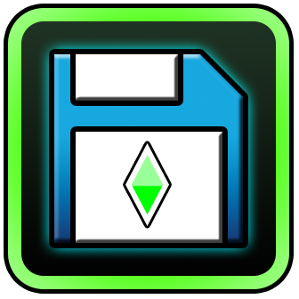

# PlatformerSaves

PlatformerSaves is a Geometry Dash mod for [Geode](https://geode-sdk.org/) that allows you to save and load your progress in platformer levels.

> This mod is based on the original [PlatformerSaves](https://github.com/0x5abe/PlatformerSaves) by [Sabe](https://github.com/0x5abe), updated for GD 2.2081 / Geode 5.7.1 with multi-slot save support.

## Features

Pick up right where you left off and enjoy taking breaks without having to leave Geometry Dash open!

- Checkpoint saving and loading for platformer levels
- Auto save at every checkpoint
- Up to 4 independent save slots per level

## Known bugs

- Incompatibility with xdBot. The option "Always Practice Fixes" should be disabled when using this mod. Recording or playing back macros with the mod installed may cause issues.
- Music and sound effects can occasionally get out of sync
- Player colors applied to objects may not update if the player changes their colors mid-session
- Practice Fix is not fully implemented (some player data is not saved, same as vanilla)

## Report a bug

Found something broken? [Open an issue](https://github.com/dickersonweston-eng/PlatformerSaves/issues) — please check if it's already been reported before creating a new one.

## Credits

- [Sabe](https://github.com/0x5abe) for creating the original PlatformerSaves mod
- The Geode team for building the mod loader that made this possible